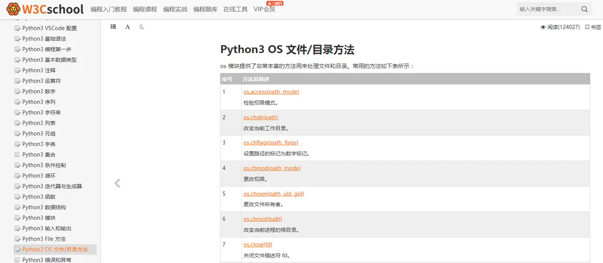

---
title: "python 入门学习"
author: 周一澍
date: "2020-09-23"
subject: "Markdown"
keywords: [Jorek, APS, VTune]
---

---
## 1. 缩进非常重要

对于其他语言缩进可能只是影响代码美观。

但Python使用缩进来表示代码块，因此必须使用一致的缩进。否则会导致语法错误。

日常编码过程中，可以使用IDE（集成开发环境）来提升效率，避免缩进等一些基础代码错误的产生。

推荐几款较为流行的IDE：

-   Visual Studio Code
    
-   PyCharm
    
-   Spyder
    
---
## 2. 选择合适的版本

这是大部分编程语言都存在的注意事项。

Python有多个版本，包括2.x和3.x系列。

要根据自己的需求和项目要求选择合适的版本，尽可能避免使用已经过时的版本。

新启的项目尽量使用较为新的版本，但最好避免beta（测试版）。

针对老项目开发维护时，注意所使用语法与库的对应版本，避免出现版本BUG。

---
## 3. 熟悉Python的内置库

Python有很多内置的库，如os、sys、math等，它们可以使编程更加高效。

因此，必须学习这些库的用法，熟练掌握它们的功能和用法。

较少在一些基础功能上重复造轮子，同时还不利于后期代码维护。

---
## 4. 理解变量和数据类型

Python是一种动态类型语言，因此变量的类型可以随时更改。

了解Python中的各种数据类型，如整数、字符串、列表、元组、字典等是很重要的。

避免因为变量类型改变，而导致前端或者数据库等强类型场景下出现错误。

> 对于学习Python基础知识，建议可以通过Python官网或者[编程狮(w3cschool)](https://links.jianshu.com/go?to=https%3A%2F%2Fwww.w3cschool.cn%3Ffcode%3Dowjs)等平台。
> 
> 编程狮上提供了Python中文文档教程跟大量支持边学边练的微课课程，我当初入门的时候也是通过边看文档边动手敲一些基础代码逐渐上手的。

---
## 5. 学习Python标准库以及其他常用的第三方库/框架

Python有丰富的标准库，以及数以千计的第三方库可以使用。

学习并熟练掌握其中一部分常用的库，可以使编程变得更加轻松。

切勿重复造轮子，这是老生常谈的话题。

接手新项目，第一要点就是先看看有没有能贴合项目需求的库与框架。

但注意最好使用相对有社区热度、保持更新迭代的库与框架。

常用的库包括：

-   NumPy
    
-   Pandas
    
-   Matplotlib
    
-   Scipy
    
-   Django
    
-   Flask
    
-   Pygame

---

## 6. 了解异常处理机制，熟练使用调试工具

在编写程序时，可能会发生各种错误和异常。

因此，了解Python的异常处理机制非常重要，以便可以及时识别和解决这些问题。

Python提供了很多调试工具，如pdb、ipdb等。

学习和熟练使用这些工具可以快速地定位和解决程序中的问题。

